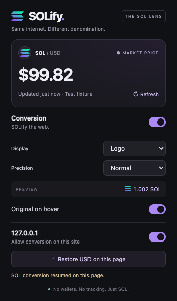
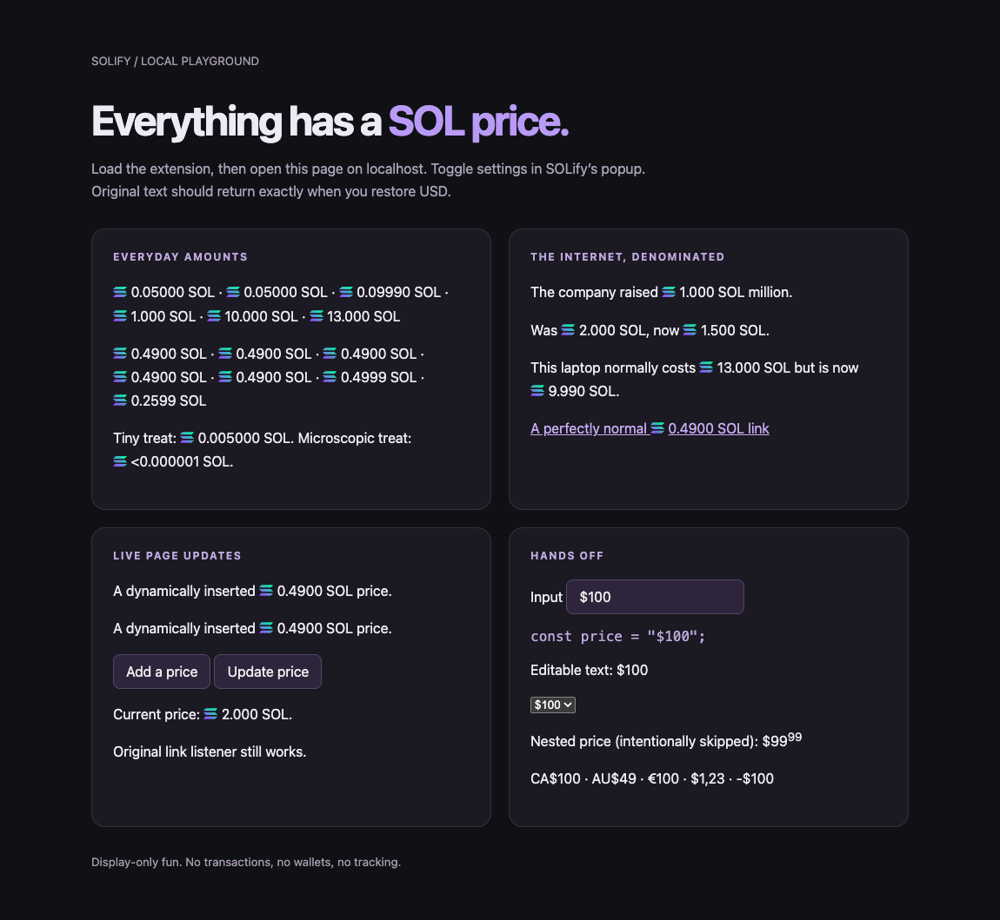

# SOLify

**Same internet. Different denomination.** A small Chrome extension that turns visible USD amounts into SOL. `$100 million` becomes `1.002 SOL million`. The surrounding words are deliberately none of our business.



## Load it in Chrome

1. Save this entire `solify` folder on your computer (unzip first if using the archive).
2. Open `chrome://extensions` in Chrome.
3. Turn on **Developer mode** in the upper-right corner.
4. Click **Load unpacked** and select the `solify` folder containing `manifest.json`.
5. Pin SOLify from Chrome’s Extensions menu. Reload any websites that were already open.
6. Open a normal website containing dollar prices. Click SOLify to change its settings.

No build step, API key, wallet, or account is required. The folder must stay on disk while Chrome uses it.

## What’s included

- Common USD notation, grouped numbers, decimals, and multiple amounts in a sentence.
- **Logo** (default), **Clean**, and **Ticker** display styles; bundled SVG logo.
- **Meme**, **Normal** (adaptive), and **Autistic** (JavaScript’s full numeric result) precision.
- Tiny positive amounts show a less-than marker such as `<0.000001 SOL` instead of a misleading zero.
- Original USD text on hover; exact-text restoration, without reverse conversion.
- Global switch, persistent hostname disabling, and a small built-in financial-site blocklist.
- **Restore USD on this page** pauses that document until Resume or reload. Global toggles and price refreshes preserve this page pause.
- Initial scanning and batched dynamic updates, with no polling of the page.
- Five-minute price cache, manual refresh, one fallback, and graceful failure.

## Try the demo

From this folder, run:

```sh
python3 -m http.server 8080 --bind 127.0.0.1
```

Open [the local playground](http://127.0.0.1:8080/tests/demo.html) in Chrome with SOLify loaded. The local server is only for development; the extension itself has no server. File URLs are intentionally outside the extension’s permissions.

Check the ordinary amounts and the multiple-price sentence. Press **Add a price** and **Update price**, click the price link, and verify that the input, code, editable text, select, and split-element price stay unchanged. Try every display and precision mode in the popup, disable the site, and restore/resume the page. Reload to verify persisted preferences.



Demo screenshots use an explicit test quote; they are not live market-price claims.

## Architecture

| File | Responsibility |
| --- | --- |
| `manifest.json` | Manifest V3 registration and permissions |
| `background/service-worker.js` | API requests, persistent quote cache, request deduplication, cooldown |
| `content/detector.js` | USD recognition, independent of the DOM |
| `utils/formatting.js` | USD / SOL rate and precision formatting |
| `content/converter.js` | Individual text-match replacement, local logo, original-text records |
| `content/content.js` | Initial scan, MutationObserver batching, restoration and setting changes |
| `utils/settings.js` | Defaults, validation, financial-site protection |
| `popup/` | Plain HTML, CSS, and JavaScript controls |

The converter inserts one inline span per recognized amount. It never rewrites a parent’s `innerHTML`, changes form values, edits attributes containing application data, or touches website JavaScript state. A Map tracks owned spans and exact original text; markers keep output idempotent. External edits inside those spans are preserved and reconsidered as new content. Removed subtrees release their records. Scanning prunes unsafe branches and replaces at most 250 candidate text nodes per batch.

Regular quote retrieval does not rewrite existing pages. Each document pins its quote, including newly added prices, until reload or a **successful manual refresh**. The popup displays the shared cache and reports the page quote separately when available. Manual refresh applies the fresh quote to active conversion documents; paused documents stay paused.

## Market-price provider

Primary: [Coinbase public spot price](https://docs.cdp.coinbase.com/coinbase-business/track-apis/prices), `https://api.coinbase.com/v2/prices/SOL-USD/spot`. It has a simple response and requires no authentication. The endpoint returned HTTP 200 and `Access-Control-Allow-Origin: *` during implementation verification.

Fallback: [Kraken public ticker](https://docs.kraken.com/api-reference/market-data/get-ticker-information), `https://api.kraken.com/0/public/Ticker?pair=SOLUSD`, using its last trade. This endpoint was also verified without a key.

All requests originate in the extension service worker with explicit API host permissions, so they do not depend on a visited website’s CORS policy. No webpage content or URL is sent. [Coinbase’s published authenticated quotas](https://docs.cdp.coinbase.com/coinbase-app/api-architecture/rate-limiting) are not a guarantee for anonymous requests; SOLify therefore uses a five-minute cache, deduplicates simultaneous requests, limits refresh attempts to once per minute, and handles non-200 responses (including rate limits). Each provider has an eight-second timeout.

After failure, a quote less than 15 minutes old may be used with an error message in the popup. Without a usable cache, new documents remain in USD and retry after a minute while conversion is enabled. Existing documents retain their pinned quote. No rate is fabricated. Price APIs and anonymous availability can change; this is a visual utility, not an executable trade quote.

## Privacy and permissions

**No tracking, analytics, telemetry, accounts, browsing-history collection, or remote executable code.** The only extension-originated network calls retrieve SOL/USD prices from the two providers. Providers can see ordinary request metadata such as your IP address. Requests omit credentials and referrers.

- `storage`: settings, local hostname denylist, and quote cache. No sync or cloud database.
- `activeTab`: read the current hostname when you open SOLify and address its page controls. No broad `tabs` permission.
- HTTP/HTTPS content-script access: necessary to visually convert prices across normal websites. Chrome shows a broad website-access warning for this capability.
- Two API host permissions: service-worker price retrieval.
- A web-accessible, locally bundled Solana SVG: inline logo display only.

The built-in list blocks a small set of banks, brokers, crypto exchanges, payment services, and tax portals, including their subdomains. It cannot be overridden in the popup. You can disable other hostnames yourself; those entries are exact hostnames. It is not an exhaustive financial-site database.

## Development and checks

Production code is dependency-free. After editing it, click Reload for SOLify at `chrome://extensions`, then reload the test webpage. Open the service-worker inspector from the extension card to inspect rate failures; right-click the popup and choose Inspect to debug its UI.

Fast tests need Node.js 18+:

```sh
node --test tests/unit.cjs tests/rates.cjs
```

Optional browser integration tests use Playwright and an isolated temporary Chrome for Testing profile:

```sh
npm install --no-save --package-lock=false playwright
npx playwright install chromium
node tests/browser.cjs
```

The integration runner starts its own local server, loads the actual MV3 extension, seeds a deterministic quote, exercises content and popup behavior, and removes its temporary profile. It mocks only the active-tab selection when rendering the popup as a full page, and mocks provider failure for the offline case. It covers site edits, exact restoration, duplicate protection, settings, disabled domains, dynamic prices, a 2,000-price batch, and protected financial hosts. `PLAYWRIGHT_MODULE` and `CHROMIUM_PATH` may point to existing tooling; `SOLIFY_SCREENSHOTS` optionally selects a screenshot folder.

## V1 limits

- Prices split across nested elements are skipped to preserve the site’s structure. Shadow DOM, frames, canvas, images, PDFs, and Chrome’s internal/store pages are not processed.
- Bare `$` is assumed USD. Common explicit non-USD prefixes are excluded, but this is not a currency-language parser. Negative amounts, malformed groupings, and amounts above JavaScript’s safe integer range are skipped.
- `million`/`billion` and surrounding prose are untouched. Long precision uses floating-point arithmetic, not arbitrary-precision finance math.
- Invisible content is skipped. Newly inserted content and changes to `hidden`/`aria-hidden` are observed; CSS-only visibility changes to existing content may require a reload.
- Only visible DOM text changes. Websites reading their own rendered text can still notice replacements; some reactive sites may repeatedly replace them. Restore USD or disable the site if needed. Compatibility with every framework is not guaranteed.
- Logos gracefully disappear when a site blocks their image. Host CSS may affect inline appearance.
- Original strings are preserved while owned spans exist. If a site removes or replaces a subtree, SOLify respects that new content and does not reconstruct the old page.
- Site-specific disable follows the exact hostname. Restoring a page is document-local and resets on navigation/reload.

## Later, maybe

BTC, ETH, additional display modes, and Firefox support. None are implemented in V1.
